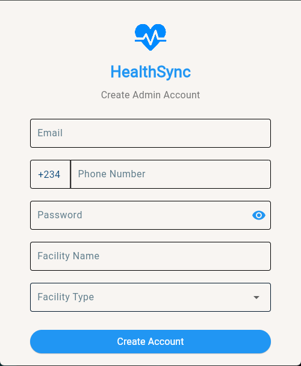
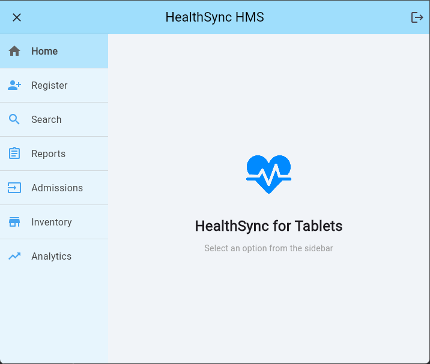
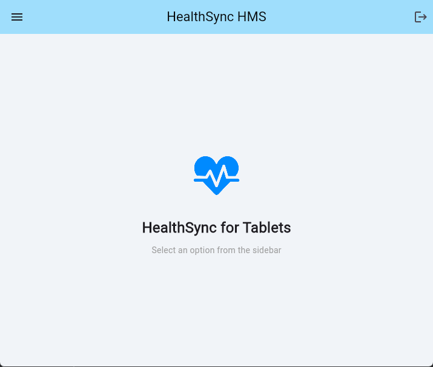

# HealthSync

**A Unified Management Platform for Healthcare Facilities**

## Overview
HealthSync provides integrated management solutions for both hospitals and pharmacies, featuring specialized interfaces for each facility type with responsive tablet compatibility.

---

## Key Features

### Facility-Specific Modules
- **Hospital Management**:
  - Patient registration & EHR tracking
  - Staff scheduling
  - Operating room management

- **Pharmacy Management**:
  - Prescription processing
  - Medication inventory
  - Insurance billing

### Cross-Functional Tools
- Real-time inventory tracking
- Analytics dashboard
- Multi-user access control

---

## Interface Showcase

### Authentication Screens
| Login Screen | Signup Screen |
|--------------|---------------|
|  |  |

### Hospital Dashboard (Tablet)
**State 1 - Overview Mode**  
  
*Default dashboard showing patient flow and key metrics*

**State 2 - Expanded Mode**  
  
*Detailed view with sidebar navigation and expanded patient details*

### Pharmacy Dashboard
  
*Medication management interface with inventory alerts*

---

## Application Flow

1. **Authentication**  
   - All users start at login screen
   - Signup requires facility type selection (Hospital/Pharmacy)

2. **Role-Based Routing**  
   - System directs to appropriate dashboard based on:
     - Facility type
     - User permissions

3. **Tablet Interface States**  
   - *Hospital users* can toggle between:
     - Compact overview (State 1)
     - Expanded management view (State 2)
   - *Pharmacy users* receive single optimized view

---

## Technical Specifications
- **Responsive Design**: Optimized for tablet use
- **State Management**: Preserves UI states during navigation
- **Data Sync**: Real-time updates across all views
