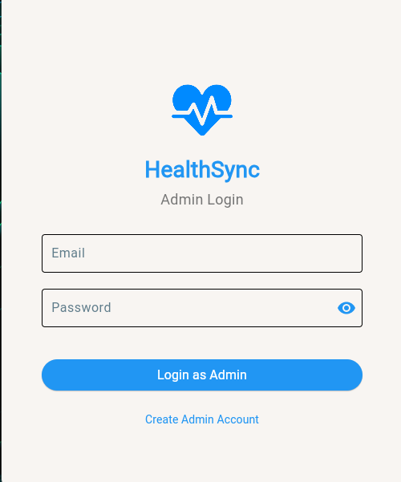

# HealthSync

A Management Service for Hospitals & Pharmacies.

## Features
- Hospital-based Functionalities & Pharmacy-based functionalities
- Patient Registration and Management
- Inventory & Stock Management
- Analytics

## Application Screenshots

### Login Screen

*The main login screen for accessing the application.*

### Hospital Dashboard

*The dashboard for hospital management, showcasing the tablet view with sidebar navigation.*

### Pharmacy Dashboard

*The dashboard for pharmacy management, showcasing the tablet view with sidebar navigation.*

## App Flow & Logic
- `Displays Login screen first, with option to create new account`
- `After successful Login/Sign Up, User is directed to the dashbpoard depending on the Facility Type they chose during Sign Up`
- `Hospital Dashboard`
